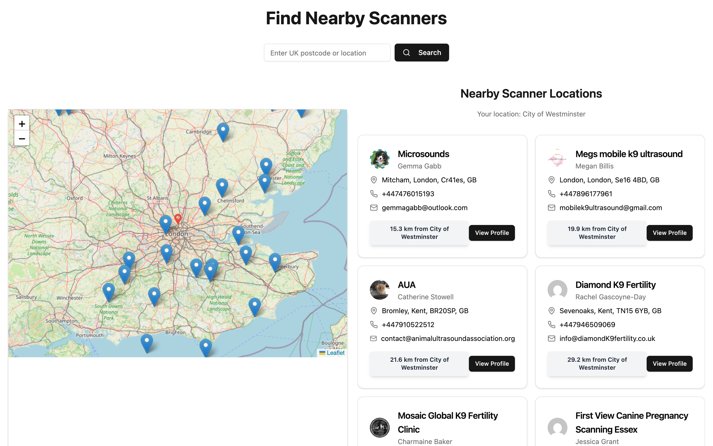

# AUA Members Directory

A geo-search directory for the [Animal Ultrasound Association](https://animalultrasoundassociation.org)
— members of the public enter a UK postcode and get the nearest accredited
veterinary ultrasound scanners, ranked by distance and plotted on a map.

**Live:** https://aua-members-directory.vercel.app



## What it does

- **Postcode / location search** with geocoding, defaulting to the visitor's
  detected location.
- **Distance-ranked results** — each member card shows the practice, the
  practitioner, contact details and how far away they are.
- **Interactive Leaflet map** with a pin per member, synced to the result list.
- **Member profiles** for each listing.

## Stack

React 18 · TypeScript · Vite · Tailwind CSS · Leaflet

## Running locally

```bash
npm install
npm run dev          # http://localhost:5173
```

```bash
npm run build && npm run preview
```

## A note on the screenshot

The directory shows real members' phone numbers and email addresses — they're
public on the live site, but a README hero image pushes them further than the
members may expect. `docs/screenshot.png` is best cropped to the map and search
bar, or captured with the contact lines blurred.
